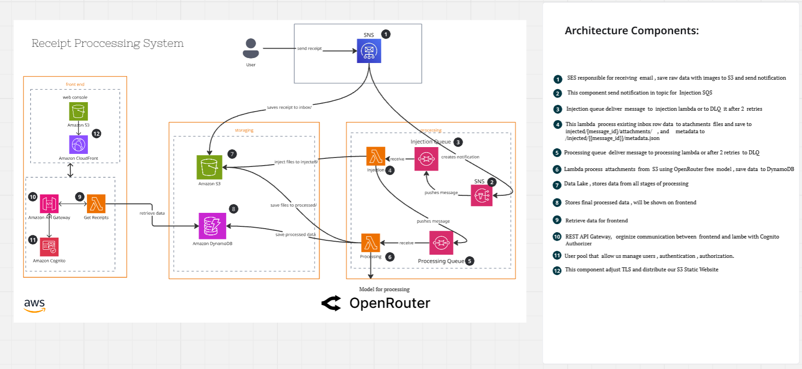
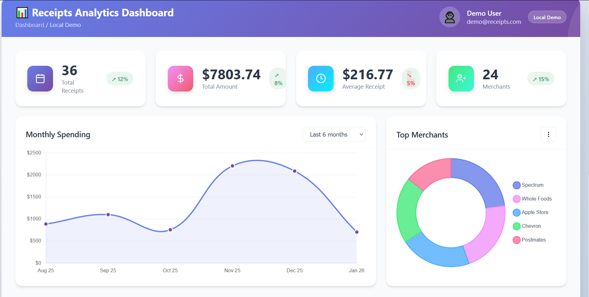
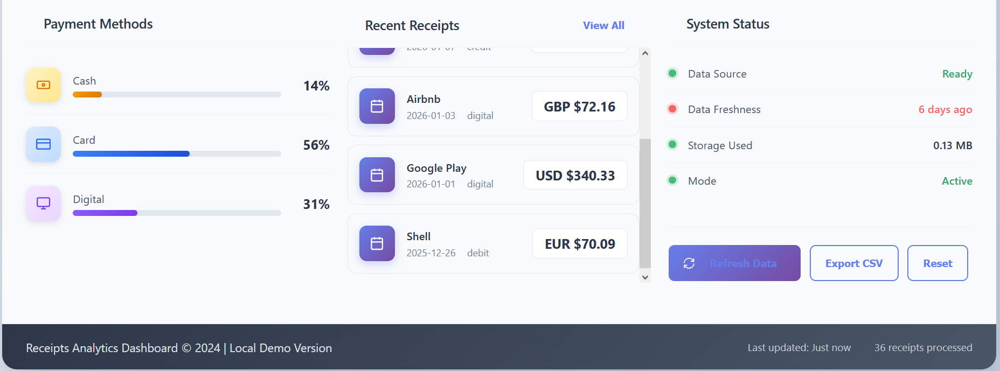

# Receipt Processing System

## Overview
The **Receipt Processing System** is an AWS-based serverless application designed to receive, process, and store receipts uploaded by users. The system leverages event-driven architecture and integrates AI/ML processing (via OpenRouter) for extracting data from receipts, storing processed information, and providing secure frontend access for users.

The architecture is scalable, fault-tolerant, and fully managed using AWS services including Lambda, S3, DynamoDB, SNS, SQS, API Gateway, and Cognito. Highly cost-effective, leveraging AWS's pay-per-use model. Operational costs scale directly with usage, and significant savings can be achieved by applying the strategies below.




---

## Architecture Components

1. **SES (Simple Email Service)**
   - Receives incoming emails with receipt attachments.
   - Stores raw data in S3 and sends notifications to SNS.

2. **SNS (Simple Notification Service)**
   - Sends notifications for incoming receipts to trigger Lambda processing.
   - Publishes messages to injection or processing queues.

3. **SQS (Simple Queue Service)**
   - **Injection Queue:** Receives messages from SNS for initial processing.
   - **Processing Queue:** Receives messages for detailed processing tasks.
   - Supports retry logic and DLQ for failed messages.

4. **Lambda Functions**
   - **Injection Lambda:** Processes incoming inbox data, saves attachments in S3, and generates metadata JSON.
   - **Processing Lambda:** Retrieves attachments from S3, sends them to OpenRouter for processing, and stores results in DynamoDB.
   
5. **S3 (Simple Storage Service)**
   - **Inbox:** Stores raw receipt files.
   - **Injected:** Stores files ready for processing.
   - **Processed:** Stores final processed data and metadata.
   - Acts as a Data Lake for analytics.

6. **DynamoDB**
   - Stores structured metadata and processed receipt information for easy querying.

7. **API Gateway**
   - Provides REST endpoints for the frontend to retrieve processed receipt data.

8. **Cognito**
   - Handles authentication and authorization for the frontend application.

9. **CloudFront + S3 Web Console**
   - Hosts a static frontend website with TLS support and distribution via CloudFront.

10. **OpenRouter**
    - Processes receipt images and extracts relevant data using AI/ML models.

---

## Workflow

1. A user sends a receipt via email.
2. SES receives the email, stores attachments in S3, and sends a notification to SNS.
3. SNS publishes messages to the **Injection Queue**.
4. **Injection Lambda** processes messages, stores attachments in `injected/`, and creates metadata in JSON format.
5. Messages are delivered to the **Processing Queue** for further processing.
6. **Processing Lambda** retrieves attachments from S3, sends them to OpenRouter for processing, and saves processed data in DynamoDB.
7. Frontend fetches processed data through API Gateway and displays it to users.
8. All raw and processed data are stored in S3 as a **Data Lake** for analytics.

---

## Installation & Deployment

1. **Clone the repository**
   ```bash
   git clone https://github.com/yourusername/receipt-processing-system.git
   cd receipt-processing-system

2. **Deploy Infrastructure**

   * Use AWS CDK, Terraform, or CloudFormation scripts included in the repo to deploy services:

     ```bash
     cd terraform
     terraform init
     terraform apply
     ```

3. **Configure Environment Variables**

   * Set Lambda and API Gateway environment variables for:

     * SNS Topic ARN
     * SQS Queue URLs
     * DynamoDB Table Names
     * OpenRouter API keys

4. **Frontend**

   * Upload static frontend files to S3.
   * Configure CloudFront distribution for secure TLS delivery.

---

## Usage

* **Send Receipts**

  * Users send receipts to the designated email address.
* **View Receipts**

  * Access the frontend web console to view processed receipt data.
* **API Access**

  * Use REST API endpoints with JWT tokens issued by Cognito.

